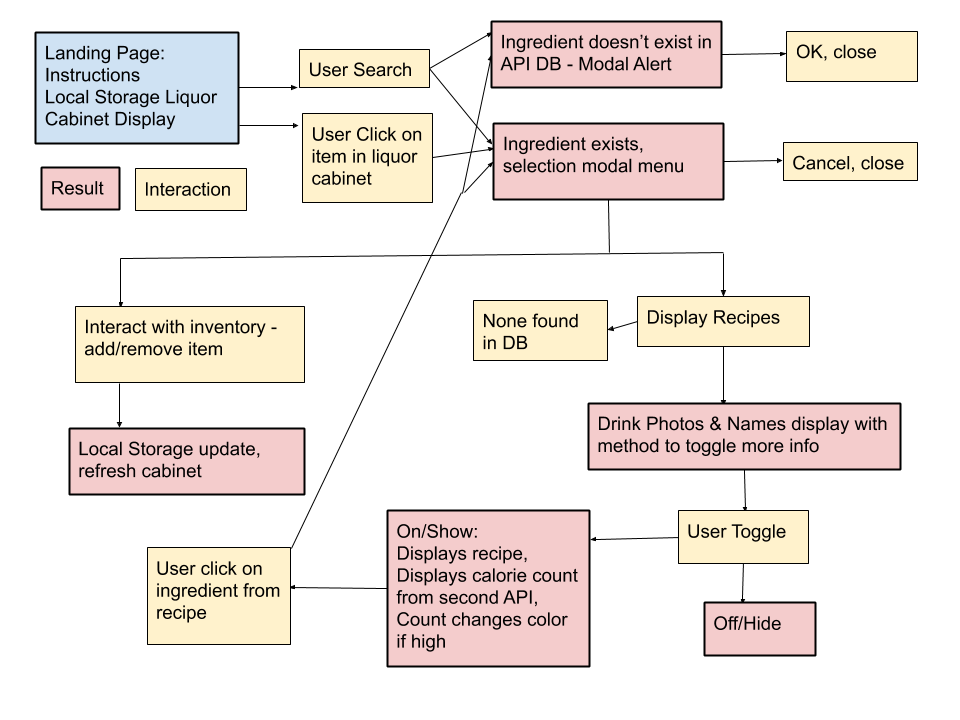
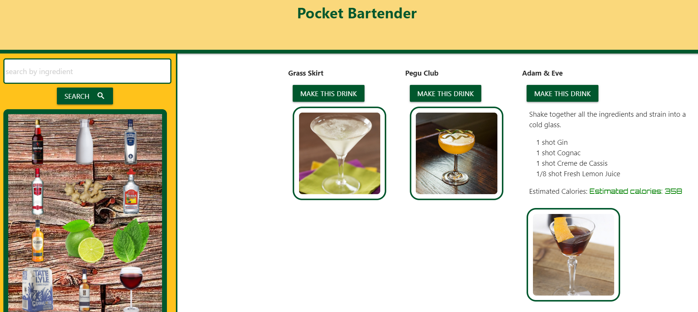
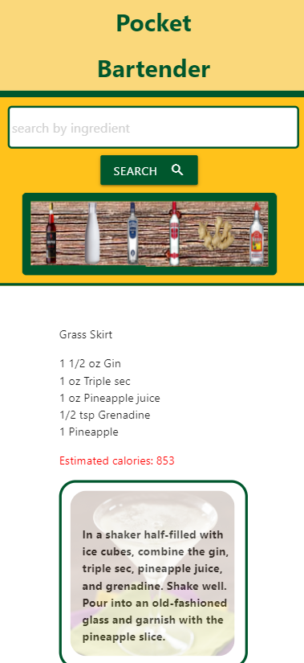

# Pocket Bartender

> We've created an App that does 3 main things. First it keeps track of what is in your real life liquor cabinet, you can add new items, and when you run out, you can remove them. Next, it can be used to get cool drink recipes to make with your liquor cabinet, or get inspired what to add to your cabinet next based on the suggestions. Finally, for those conscious of what they are consuming, we have a calorie counter to help users make decisions about which recipes to follow.

Check it out [here](https://agtravis.github.io/pocket-bartender/index.html)!

## Table of contents

- [General info](#general-info)
- [Screenshots](#screenshots)
- [Technologies](#technologies)
- [Setup](#setup)
- [Features](#features)
- [Status](#status)
- [Inspiration](#inspiration)
- [Contact](#contact)

## General info

The purpose of the app is to help users get more creative when either hosting a group of people at a cocktail party, or even just when they are relaxing on their own. It is both an inventory tool and a reference guide, but based around a fun and social activity. The motivation behind the app was simple - just 3 web developers with a passion for trying new things, and if the new things happen to be adult beverages then that's just how the ingredients muddled!

## Screenshots

## Technologies

- [Materialize](https://materializecss.com/)
- [Axios](https://github.com/axios/axios)
- [Nutritionix](https://www.nutritionix.com/business/api)
- [TheCocktailDB](https://thecocktaildb.com/)

## Setup

This is an app that runs in the browser, and interacts with the user's local storage. No additional setup required.

## Features

List of features ready and TODOs for future development

- Tracks user's ingredients and liquor cabinet
- Suggests recipes to the user based on their inventory or potential future purchases
- Estimates calorific values so the user can decide based on their diet which recipe to follow

To-do list:

- create a 'cocktail shaker' modal that the user fills with multiple ingredients before searching for a recipe.
- Interface with Google maps and geolocation APIs to display maps to nearby liquor store
- Embed Youtube videos of available cocktails being made
- Perform additional queries with as yet undefined APIs that would generate facts, trivia, or quotes about ingredients and cocktails at random.

## Status

Project is: MVP. Some code could be rewritten to avoid a) having some hardcoded HTML, and b) to DRY out the script. A few bugs remain, but nothing to decrease the user's experience substantially. These are being worked on. Please feel free to contact one of the contributers if a bug is discovered.

## Contact

Created by [@agtravis](https://agtravis.github.io/), [@ariehh1](https://github.com/ariehh1), & [@twopcz](https://github.com/twopcz).
